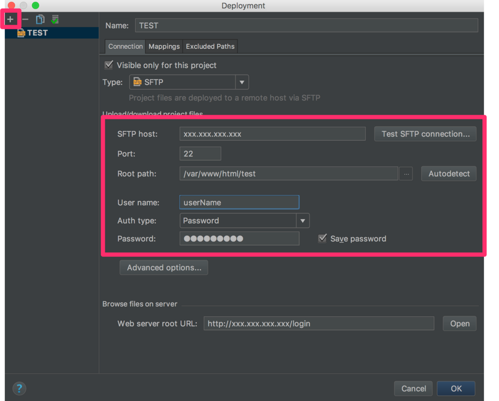
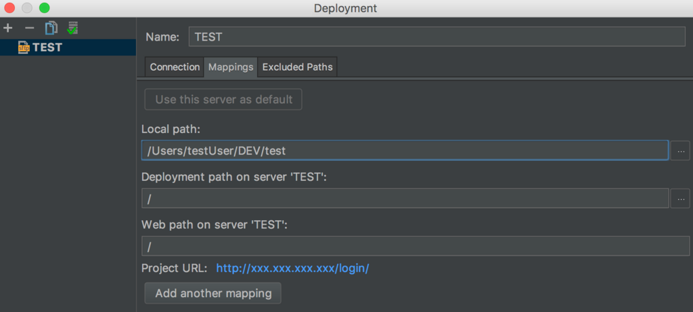
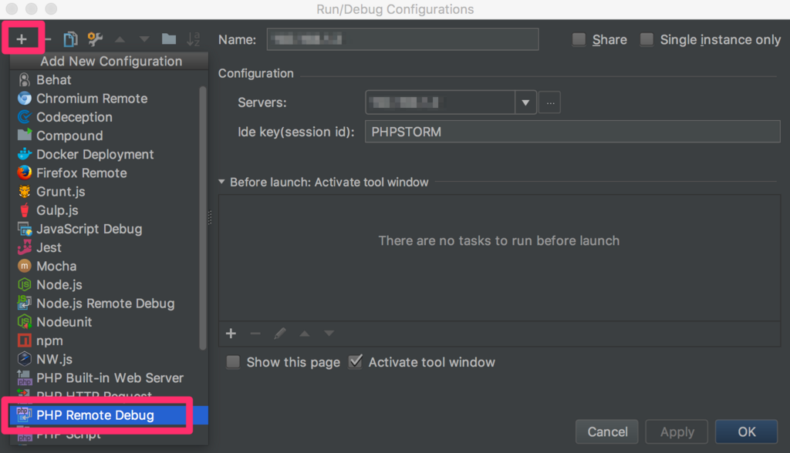

## Xdebug?

* デバック及びプロファイリング機能を提供するPHP拡張モデュール
* PECLを用いてインストール可能

## 1. Xdebugをインストール（CentOS）

### php-devel、php-pearをインストール

```command
yum install php-devel
yum install php-pear
```

### gcc、gcc-c++、autoconf、automakeをインストール

```command
yum install gcc gcc-c++ autoconf automake
```

### Xdebugをインストール

```command
pecl install Xdebug

// ※エラーになる場合
// yum --enablerepo=remi-phpバージョン install php-devel php-pear
yum --enablerepo=remi-php56 install php-devel php-pear
```

### /etc/php.iniを修正

```command
vi /etc/php.ini
```

↓以下を追加

```json
[xdebug]  
zend_extension="/usr/lib64/php/modules/xdebug.so"  
xdebug.default_enable = 1  
xdebug.remote_enable = 1  
xdebug.remote_port = 9000  
xdebug.remote_handler = dbgp  
xdebug.remote_autostart = 1  
xdebug.profiler_output_dir = "/tmp"  
xdebug.max_nesting_level = 1000  
xdebug.idekey = "PHPSTORM" //PhpSTORMで設定したideKey  
xdebug.remote_host=xxx.xxx.xxx.xxx  
```

### Apacheをリスタート

```command
service httpd restart
```

## 2. PhpStormでの設定

### リモートホストの設定

#### 1.Remote Hostを表示

[ Tools > Deployment > Browse Remote Host ]をクリックする

#### 2. サーバーを登録

[ Tools > Deployment > Configuration... ]　を開く



* `[test SFTP connection]` をクリックし、成功することを確認



### PHPリモートデバッグの設定

[ Run > Edit Configurations... ]　を開く



1. PHP Remote Debugをクリック
2. 名前、サーバーIPアドレス、Ide Key(※php.iniで設定したKey)
などを設定する

これでPhpStorm + Xdebugでリモートデスクトップ環境構築完了！
