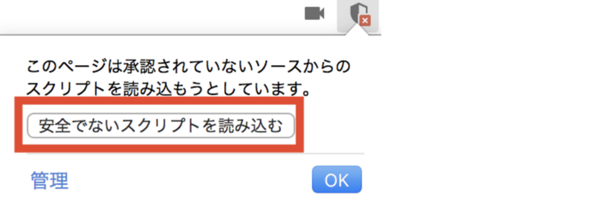
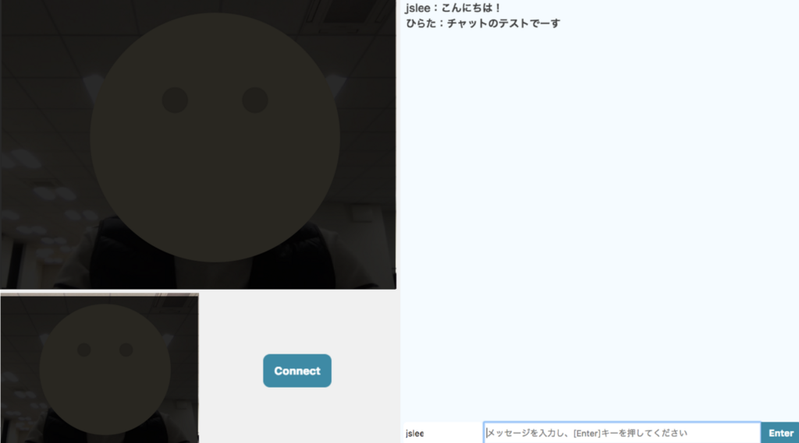

こんにちは！
[Fusic Advent Calendar 2017](https://qiita.com/advent-calendar/2017/fusic) 21日目の記事です。

`WebRTC`を触ってみた話をさせていただきます。

# WebRTCとは
WebRTC(Web Real-Time Communication)は、ウェブブラウザーの間で特定のプラグインがなくても通信できるAPIです。

[W3C](https://ja.wikipedia.org/wiki/World_Wide_Web_Consortium)で提示された草案であり、

映像、音声、P2Pファイル共有などで活用できます。

### WebRTC API

WebRTCで提供するAPIは以下の三つです！

#### 1. MediaStream

ユーザー端末機のビデオ、マイクにアクセスできます。

`getUserMedia`を使ってアクセスし、MedisStreamオブジェクトを`PeerConnection`に渡して転送することになります。

#### 2. PeerConnection

一番重要なAPIであり、ブラウザ間でビデオ、音声などのやりとりするAPIです！

#### 3. DataChannel

ブラウザ間でのテキストやファイルなどをやりとりします。

## 事前準備

- Webサーバー
- [Node.js](http://lighthouse-dev.hatenablog.com/entry/2018/03/08/230508)
- WebSocket

## カメラを触ってみよう

Webサーバーに以下のサンプルコードを作成し、試してみましょう！

#### サンプルコード

```html
<!doctype html>
<html>
  <head>
    <title>Self Camera</title>
  </head>
  <body>
    <video id="myVideo" width="400" height="300" autoplay="1" ></video>

    <script type="text/javascript">
      navigator.getUserMedia = navigator.getUserMedia || navigator.webkitGetUserMedia || window.navigator.mozGetUserMedia;
      window.URL = window.URL || window.webkitURL;

      var video = document.getElementById('myVideo');
      var localStream = null;
      navigator.getUserMedia({video: true, audio: false}, 
      function(stream) { // for success case
        console.log(stream);
        video.src = window.URL.createObjectURL(stream);
      },
      function(err) { // for error case
        console.log(err);
      }
      );
    </script>
  </body>
</html>
```

最初ブラウザーからアクセスすると、カメラにアクセスしてもいいかどうかの確認ダイアログが表示されるので、

OKボタンを押して許可してください。

## シグナリングサーバーを動かす

#### ・WebRTCの通信について

WebRTCでは、映像や音声などリアルタイムに取得されたデータを、ブラウザ間で送受信することができます。
それを司るのが　RTCPeerConnection です。 RTCPeerConnectionには2つの特徴があります。

- Peer-to-Peer(P2P)の通信 → ブラウザとブラウザの間で直接通信する
- UDP/IPを使用 → TCP/IPのようにパケットの到着は保障しないが、オーバーヘッドが少ない(らしい)

#### ・P2P通信を行うために

ブラウザ間でP2P通信を行うには、

- 相手のIPアドレスを
- 動的に割り振られるUDPのポート番号

を知る必要があります。

そのために、WebRTCでは以下の情報をやり取りしています。

##### SDP (Session Description Protocol)

- セッションが含むメディアの種類（音声、映像）、
- メディアの形式（コーデック）
- IPアドレス、ポート番号 などなど

###### ICE (Interactive Connectivity Establishment)

- P2Pによる直接通信
- NATを通過するためのSTUNサーバーから取得したポートマッピング → 最終的にはP2Pになる
- Firefallを越えるための、TURNによるリレーサーバーを介した中継通信

#### ・シグナリングサーバーを動かしてみよう！

P2Pを始めるまでの情報のやり取りを「シグナリング」と言います。

シグナリングサーバーは、クライアントからメッセージを受け取ったら他のクライアントに送信する役割をします。

##### WebSocketをのインストール

```command
npm install ws
```

##### シングルサーバーサンプルコード

```javascript
"use strict";

let WebSocketServer = require('ws').Server;
let port = 9000; //ポート番号は必要に応じて変更してください。
let wsServer = new WebSocketServer({ port: port });
console.log('websocket server start. port=' + port);

wsServer.on('connection', function(ws) {
    console.log('-- websocket connected --');
    ws.on('message', function(message) {
        wsServer.clients.forEach(function each(client) {
            if (isSame(ws, client)) {
                console.log('- skip sender -');
            }
            else {
                client.send(message);
            }
        });
    });
});

function isSame(ws1, ws2) {
    // -- compare object --
    return (ws1 === ws2);
}
```

##### シングルサーバーを起動

```command
node signaling.js
```

シグナリングサーバーの動作はシンプルで、クライアントからメッセージを受け取ったら他のクライアントに送信するだけです。

## 実際に動かしてみよう！（結果）

ブラウザーからアクセスし、スクリプトを読み込むと





こんな感じです！


## 最後に

何よりも[Fusic開発合宿](https://fusic.co.jp/doings/184)で普段から自分が作りたかったものや

新しい技術を勉強できて、とても楽しめたと思います！

まだまだいけてないところや課題もたくさんあるんですが、引き続き勉強しつつ発展させていきたいと思います！！

## 参考

- [WebRTC入門2016](https://html5experts.jp/series/webrtc2016/) 大変参考になりました！！
- あと、[SkyWay](https://webrtc.ecl.ntt.com/)というサービスもありますので、参考までに・・
