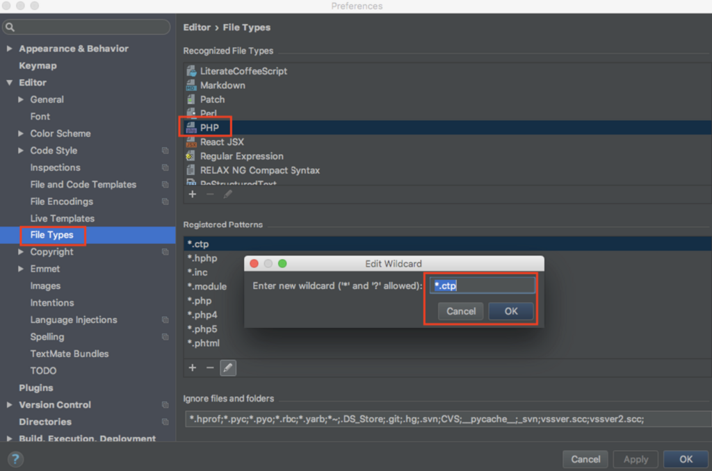
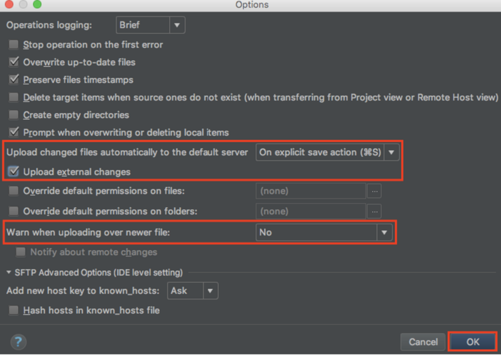

# .ctpファイルをphpファイルで認識するように設定

 

# 自動アップロード

[Tools] > [Deployment] > [Options]

 

# 自動インデント

#### メニュー

[Code] > [Auto-Indent Lines]

#### ショートカット

- Mac : control + option + "I"
- Windows : Control + Alt + "I"
