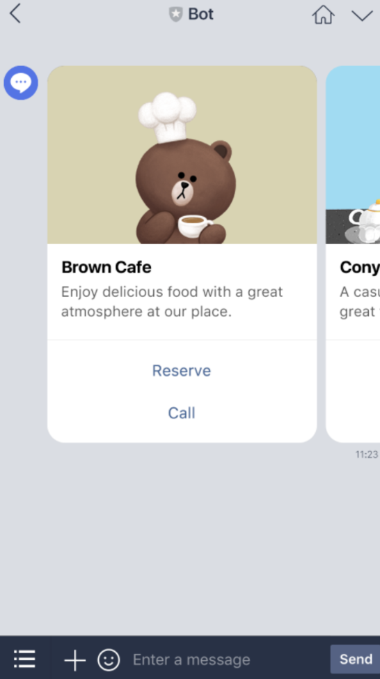
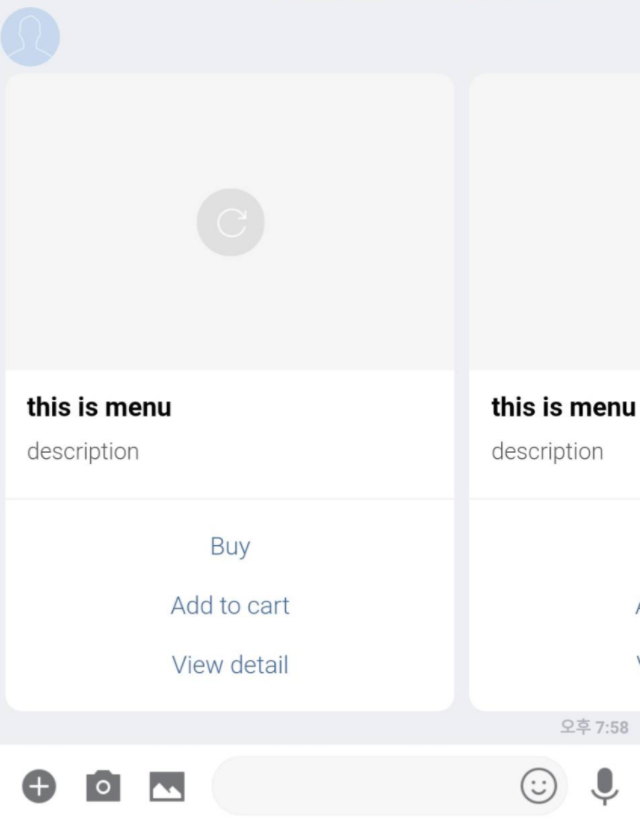

PHPでMessaging APIを動かすサンプルを紹介したいと思います。

※ LINE@MANAGERの設定については、あとで追記します！

<br>

# Messaging APIの説明

ユーザー、グループ、またはトークルームからのイベントに対して応答メッセージを送信するAPIです！

イベントが発生するとwebhookを使って通知され、応答できるイベントには応答トークンが発行されるそうです。

#### 注意点

- 応答トークンは一定の期間が経過すると無効になるため、メッセージを受信したらすぐに応答を返す必要があります。
- 応答トークンは1回のみ使用できます。

<br>

# メッセージオブジェクト

以下は、送信するメッセージの内容を表すJSONオブジェクトです。

- テキスト
- 画像
- 動画
- 音声
- 位置情報
- スタンプ
- イメージマップ
- テンプレート

この中で「テンプレートメッセージ」を見てみましょう！

## テンプレートメッセージ

テンプレートメッセージは、あらかじめレイアウトが定義されたテンプレートをカスタマイズして構築するメッセージです。

> 事前定義されたレイアウトが用意されており、よりリッチなユーザー体験の提供に役立ちます。

らしいです。また、以下のタイプのテンプレートを利用できます。

- ボタン
- 確認
- カルーセル
- 画像カルーセル

さっそく触ってみましょう！

### 画像カルーセルテンプレート

複数の画像を表示するテンプレートです。画像は横にスクロールして順番に表示できます。

以下のような感じです！



### サンプルコード

```php:title=sample.php
<?php
$replyToken = <Webhookで受信する応答トークン>
$accessToken = <アクセストークン>

$messageData = [
    "type" => "template",
    "altText" => "this is a image carousel template",
    "template" => [
        "type" => "image_carousel",
        "columns" => [
            [
                "imageUrl" => "https://example.com/bot/images/item1.jpg",
                "action" => [
                    "type" => "postback",
                    "label" => "Buy",
                    "data" => "action=buy&itemid=111"
                ]
            ],
            [
                "imageUrl" => "https://example.com/bot/images/item2.jpg",
                "action" => [
                    "type" => "message",
                    "label" => "Yes",
                    "text" => "yes"
                ]
            ],
            [
                "imageUrl" => "https://example.com/bot/images/item3.jpg",
                "action" => [
                  "type" => "uri",
                  "label" => "View detail",
                  "uri" => "http://example.com/page/222"
                ]
            ]
        ]
    ]
];

$response = [
    'replyToken' => $replyToken,
    'messages' => [$messageData]
];

error_log(print_r($response, true));

$ch = curl_init('https://api.line.me/v2/bot/message/reply');
curl_setopt($ch, CURLOPT_POST, true);
curl_setopt($ch, CURLOPT_CUSTOMREQUEST, 'POST');
curl_setopt($ch, CURLOPT_RETURNTRANSFER, true);
curl_setopt($ch, CURLOPT_POSTFIELDS, json_encode($response));
curl_setopt($ch, CURLOPT_HTTPHEADER, array(
    'Content-Type: application/json; charser=UTF-8',
    'Authorization: Bearer ' . $accessToken
));

$result = curl_exec($ch);
error_log($result);
curl_close($ch);
```

上のサンプルコードを実行すると、以下のような感じでメッセージ届く！！



以上！
