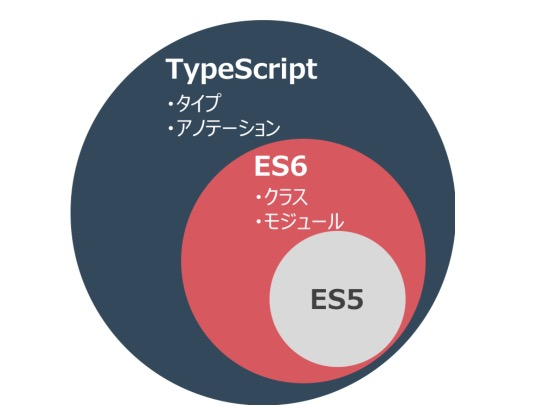

こんにちは。

福岡は昨日から急に寒くなりました・・

早く暖かくなって欲しいです 🌸

<br>

最近個人で`Angular`の勉強を始めました！！

`Angular`では`TypeScript`を使う必要があるため、

`TypeScript`について勉強するきっかけになりました。

ということで、今回は、`TypeScript`についてまとめた内容を紹介したいと思います！

<br>

# TypeScriptとは

- MSとGoogleが協業で開発。
- `TypeScript`は、新しい言語ではなく、ES6のスーパーセット。
- `TypeScript`コードは、ES6コードと100%互換。

👇以下の図みたいな感じ。



<br>

# インストール方法

インストール方法は、すごく簡単。

```command
npm install -g typescript
```

<br>


# TypeScriptを使うメリット

`TypeScript`のメリットは以下です！

- タイプ
- クラス
- デコレータ
- インポート
- 言語ユーティリティー

## タイプ

ES5から改善された点がいくつかありますが、まず1つ目は「タイプが指定できること」です。

タイプ指定に対応していないJavaScriptを好む方も一部いると思いますが、

タイプを指定できることによって、いろんなメリットが生まれます。

> 1. コードを"作成する時"に、バグを減らすことができる（コンパイルエラーになるため）
> 2. コードを"読む時"に、コードを書いた人の意図がはっきり分かる

もちろん`TypeScript`でタイプを指定しないことも可能です。

例えば、サンプルコードを書いてみたりする時には、タイプを省略し、後から指定することもできます。

### タイプ指定の例

#### 変数
```javascript
var name: string;
```

#### 関数
関数を宣言する時も、次のようにパラメーターとリターンどちらもタイプを指定できます。

```javascript
function sample(name: string): string {
  return "Hello" + name;
}
```
### タイプの種類

- string
- number
- boolean
- Array
- 列挙型
- any
- void

それでは、タイプの種類を一つずつ見ていきましょう！

#### 1. string

文字列は、`string`タイプで宣言します。

```javascript
var name: string = 'jslee';
```

#### 2. number

言葉通り"数字"を表すタイプ。

```javascript
var age: number = 26;
```

#### 3. boolean

true / false

```javascript
var married: boolean = true;
```

#### 4. Array

配列タイプです。

配列はコレクションなので、配列の中でもオブジェクトのタイプを指定する必要があります。

```javascript
var languages: Array<string> = ['PHP', 'golang', 'JavaScript'];
var languages: string[] = ['PHP', 'golang', 'JavaScript'];
```

`number`も一緒です。

```javascript
var hogehoge: Array<number> = [1, 2, 3];
var hogehoge: number[] = [1, 2, 3];
```

#### 5. 列挙型

列挙型は、`enum`を使います！

```javascript
enum Role {Employee, Manager, Admin};
var role: Role = Role.Admin;
```
列挙型のデフォルト値は`0`ですが、

次のように指定することもできます。

```javascript
enum Role {Employee = 3, Manager, Admin};
/*この場合、列挙型の値は「3」から始まります。
  なので、「Manager=4」,「Admin=5」になります。*/
var role: Role = Role.Admin;
```

もちろん、項目毎に指定することも可能！

```javascript
enum Role {Employee = 3, Manager = 5, Admin = 7};
var role: Role = Role.Admin;
```

指定した値を使う時は
```javascript
enum Role {Employee = 3, Manager = 5, Admin = 7};
console.log('Roles: ', Role[3], ',', Role[5], 'and', Role[7]);
```

#### 6. any

`any`は、変数のタイプを省略する時に、デフォルトで指定されるタイプです。

`any`タイプの変数は、どんな値も受け取ることができます！

```javascript
var something: any = 'string';
something = 1;
something = [1, 2, 3];
```

#### 7. void

`void`は、"タイプが無い"という意味です。

一般的にリターン値がない関数で使うことが多いですね。

```javascript
function setName(name: String) void {
  this.fullName = name;
}
```

## クラス

ES5では、クラスの代わりに「プロトタイプ」が使われましたが、

ES6では、`JavaScript`にクラスが導入されました！

```javascript
class sampleClass {

}
```
クラスには、プロパティとメソッド、コンストラクタを持たせます。

#### プロパティ

プロパティは、クラスのインスタンスに属するデータを定義します！

```javascript
class Person {
  firtName: string;
  lastName: string;
  age: number;
}
```

#### メソッド

```javascript
class Person {
  name: string;
  age: number;
  
  greet() {
    console.log("Hello", this.name);
  }
}

// Personタイプの変数を宣言、インスタンス生成
var p: Person = new Person();

p.name = 'jslee';

// メソッドを呼び出す
p.greet();
```

#### コンストラクタ

コンストラクタ（constructor）は、皆さんもご存知の通りインスタンスが生成される時に実行されるメソッドですね。

コンストラクタは、以下のルールを持ってます！

- 名前は、必ず`constructor`にする。
- パラメータはあってもなくても良いが、値はリターンしない。
- コンストラクタを指定していない場合は、自動で作られる。

```javascript
class sampleClass {

  constructor() {
    // 処理  
  }
}
```
#### 継承(Inheritance)

`extends`キーワードを使って、継承します！

```javascript
class sampleClass extends parentClass {

  constructor() {
    // 処理  
  }
}
```

## ユーティリティー

ES6, TypeScriptは、プログラミングをもっと楽しめる多くの文法構造を提供してます！

その中でも、以下の二つを紹介します。

- アロー関数
- テンプレート文字列
 
### アロー関数

アロー関数（=>）は、関数を作成するための縮約形表記です。

#### ES5での例
```javascript
var languages = ['PHP', 'TypeScript', 'C++'];
languages.forEach(function(language) {
  console.log(language);
});
```

#### アロー(=>)関数の書き方

```javascript
var languages: string[] = ['PHP', 'TypeScript', 'C++'];
languages.forEach( language => {
  console.log(language)
});
```

#### アロー(=>)は、`$this`を共有できる

```javascript
// ES5
var hoge = {
  name: 'jslee',
  languages: ['PHP', 'TypeScript', 'C++'],
  print: function() {
    var self = this;
    this.languages.forEach(function(language) {
      // this.nameは定義されてないので、self.nameを使う必要がある。
      console.log(self.name + 'が' + language + 'でコードを書いとる');
    })
  }
};
```

```javascript
// ES6, TypeScript - thisを共有するため、以下のように作成できる 
var hoge = {
  name: 'jslee',
  languages: ['PHP', 'TypeScript', 'C++'],
  print: function() {
    this.languages.forEach( (language) => {
      console.log(this.name + 'が' + language + 'でコードを書いとる');
    })
  }
};
```

### テンプレート文字列

ES6, TypeScriptでは、新しいテンプレート文字列が導入されました！

- 文字列中に変数（ +でつなぐ必要がなくなった ）
- 多行（multi-line）文字列

#### 文字列中に変数（string interpolation）

文字列の中に変数を使うことができるのがコツ。

```javascript
var firstName = 'js';
var lastName  = 'lee';

var greeting = `Hello ${firstName} ${$lastName}`;

console.log(greeting);
```

#### 多行文字列(multi-line)

多行文字列(multi-line)機能は、長い文字列をコードに書く時に役に立ちそうです！

テンプレートのように使えるっていうのが良さそうですね。

```javascript
var template = `
<div>
  <h1>HogeHoge</h1>
  <p>jslee</p>
</div>
`
```

<br>

# まとめ

少々長くなりましたが、ざっくりこんな感じです！

また追加したい内容があったら、追記していきます👍

<br>

以上！
