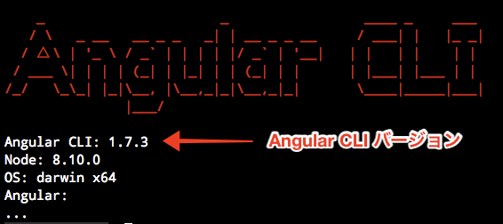
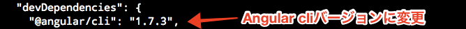
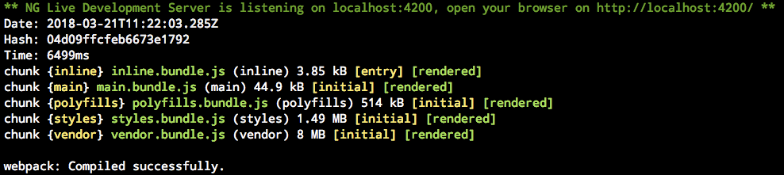

# エラー内容

> Error: Cannot find module '@angular-devkit/core'

<br>


# 解決方法

## 1. npmアップデート

```cmd
npm update -g
```

## 2. node_modulesフォルダーを削除

```cmd
rm -r node_modules
```

## 3. angular-cliバージョンを確認

```cmd
ng -v
```



## 4. package.jsonを修正

```cmd
vim package.json
```



## 5. npmインストールを実行

```cmd
npm install
```

<br>

# 確認

```cmd
ng serve
```



これで解決！
