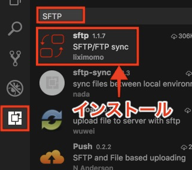
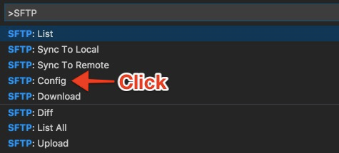

こんにちは！

普段開発エディターで [Visual Studio Code](https://code.visualstudio.com/)を使ってます。

今回は、`VSCode`でSFTPファイル同期について紹介します ✈️

<br>

# SFTP拡張モジュールをインストール

[sftp - Visual Studio Marketplace](https://marketplace.visualstudio.com/items?itemName=liximomo.sftp) をインストールし、リロードします



<br>

# 設定

## 1. 「shift + command + P」で`SFTP`を入力



## 2. `SFTP:Config`をクリックし、設定ファイルを開く

```json
{
    "protocol": "sftp",
    "host": "example.com",    // ホスト名
    "username": "test-user",  // アクセスユーザー名
    "remotePath": "/var/www/html/test_directory/",  // リモートするパス（絶対パス）
    "privateKeyPath": "/Users/jslee/example/hoge.pem", // 鍵ファイルを指定
    "uploadOnSave": true, // ファイルを保存する時に、リモートサーバーにアップロード
    "downloadOnOpen": false // ファイルを開く時に、リモートサーバーからダウンロード
}
```

基本的な設定は以上になりますが、

これ以外の設定は、[sftp - Visual Studio Marketplace](https://marketplace.visualstudio.com/items?itemName=liximomo.sftp) 👈ここを参考にしてください。
