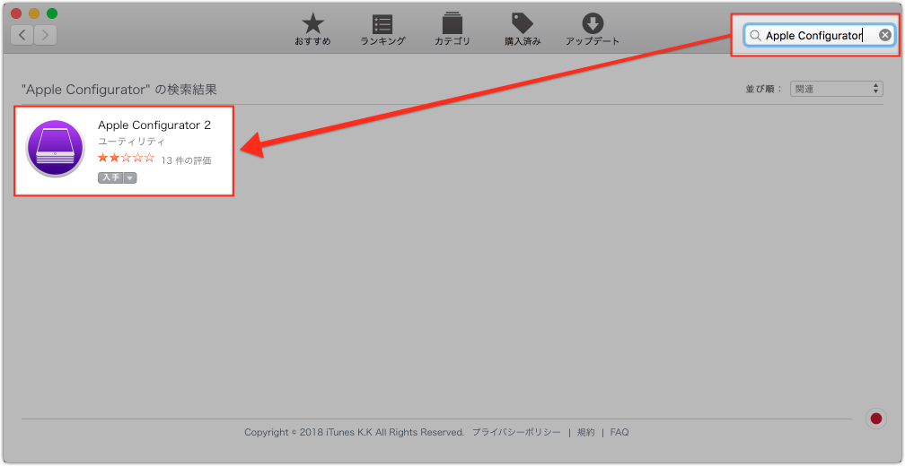
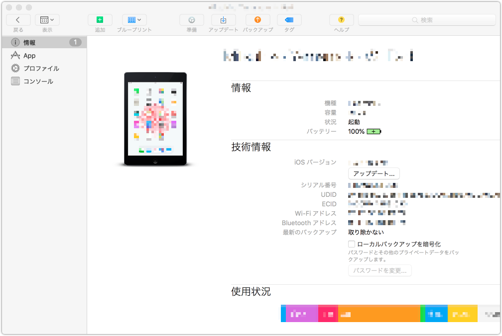
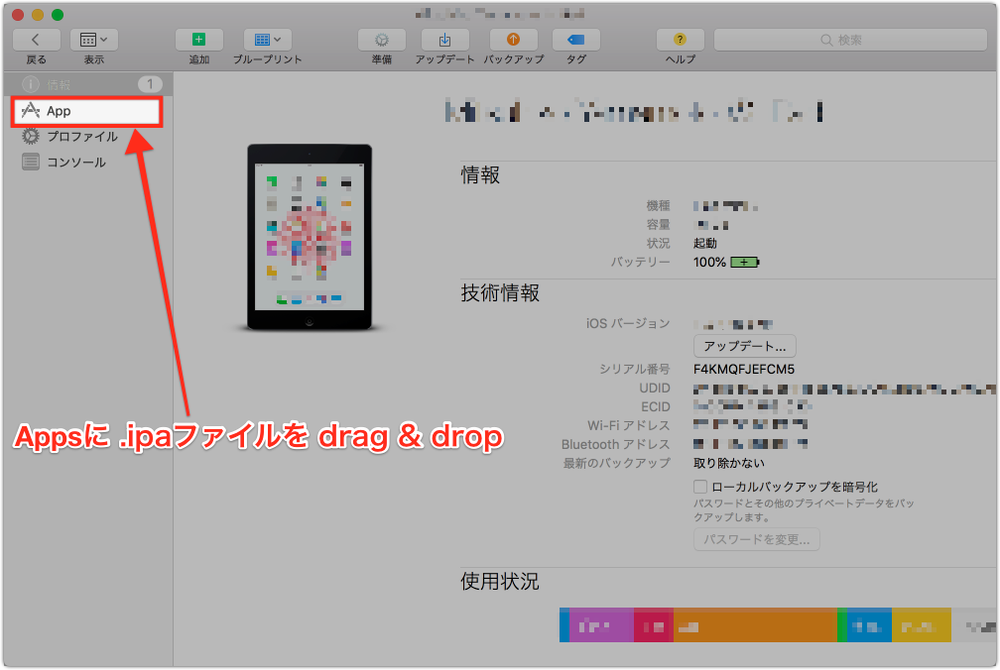
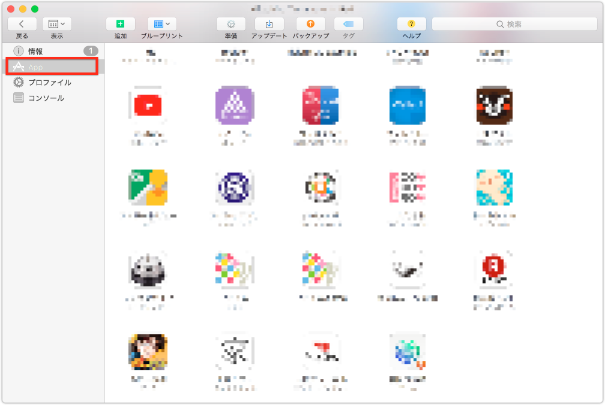
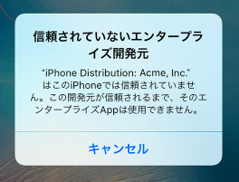
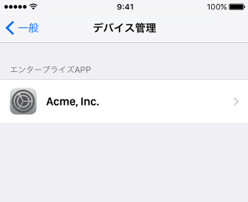
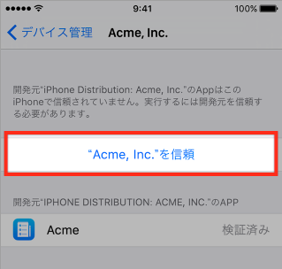

こんにちは！

最近、教務で `.ipaファイル`でIOSデバイスにカスタムのアプリをインストールすることがあったんですが、

やり方が分からない、、

で、いろいろ調べた結果、簡単にインストールできる方法が分かったので、

まとめておきたいと思います。

 

# やりたいこと

単純に.ipaファイルでIOSデバイスにカスタムのエンタープライズアプリをインストールしたい。

 

# インストール方法

`Apple Configurator`というツールを使うと、簡単にインストールできます！

## Apple Configuratorをインストール

App Sotreで`Apple Configurator`を検索し、インストールします。

## .ipaファイルでアプリをインストール

インストールした `Apple Configurator`を実行し、IOSデバイスをUSBでMacに接続します。

作成した .ipaファイルをAppsにドラッグ＆ドロップします。

うまくインストールが完了したら、以下のApps画面のリストからインストールしたアプリが表示されます。

これでアプリのインストールは完了ですが、デバイス側での設定が一つ残ってます！

## デバイス側の設定（Appを手動でインストールして信頼する）

アプリをインストールした後に実行すると、以下のようなメッセージが表示されます。(されるはず)

このメッセージを閉じた後、Appの開発元について信頼を確立できます。

「 設定 ＞ 一般 ＞ プロファイルとデバイス管理 」順にタップすると、該当する「エンタープライズアプリ」が表示されます。

「〜を信頼」ボタンをタップ。

`TIP`: この開発元は、「App を削除」ボタンを使ってその開発元の App をすべて削除しない限り、信頼されたままになります。

 

これで５分でインストール、設定完了！

 

# まとめ
IOSはAndroidよりいろいろ厳しいことが分かりました。

[iOS でカスタムのエンタープライズ App をインストールする - Apple サポート](https://support.apple.com/ja-jp/ht204460)
