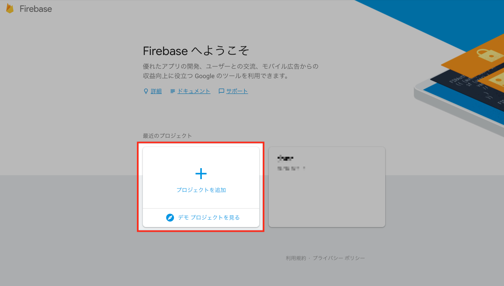
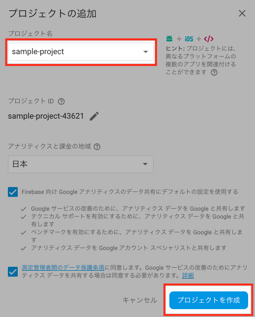
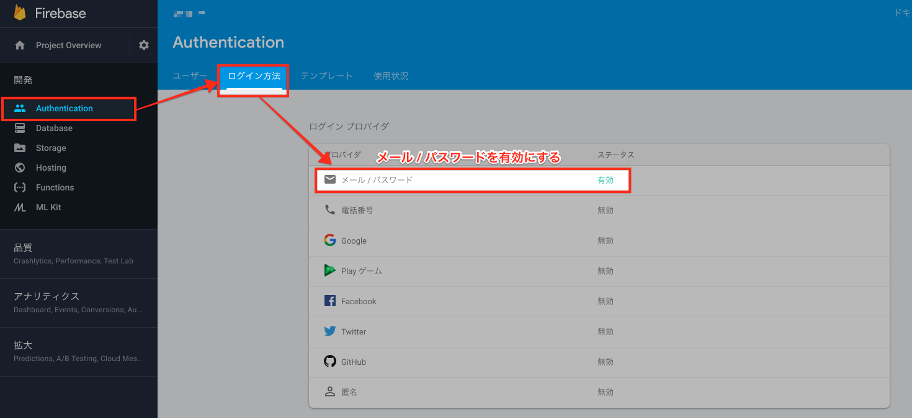
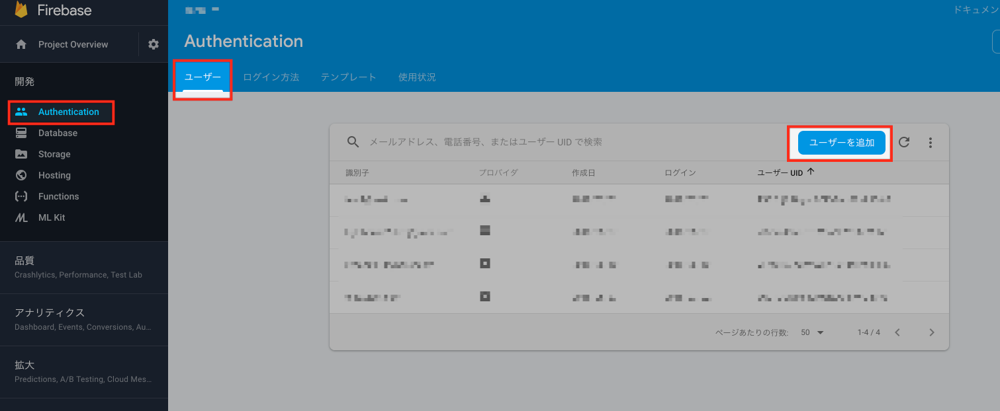
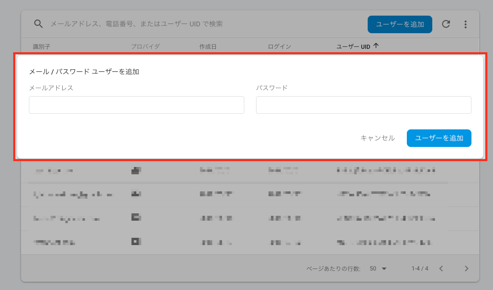
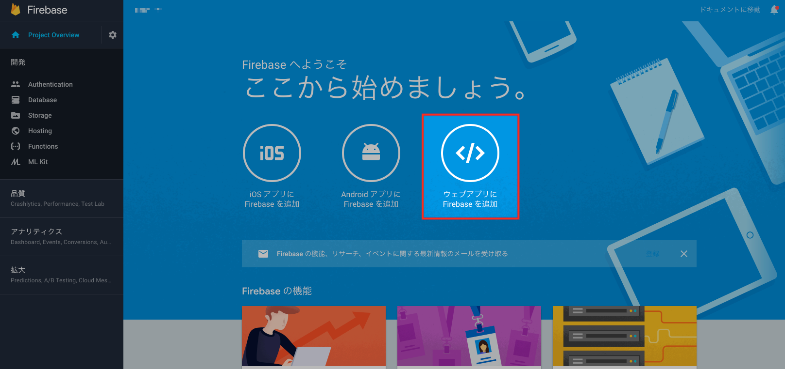
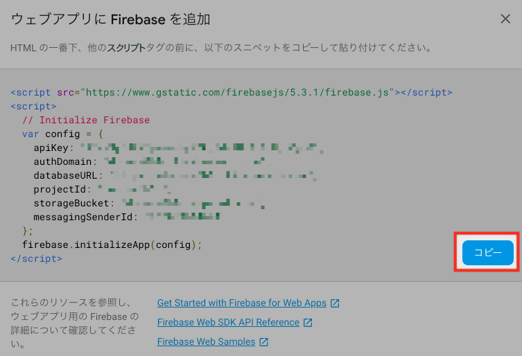
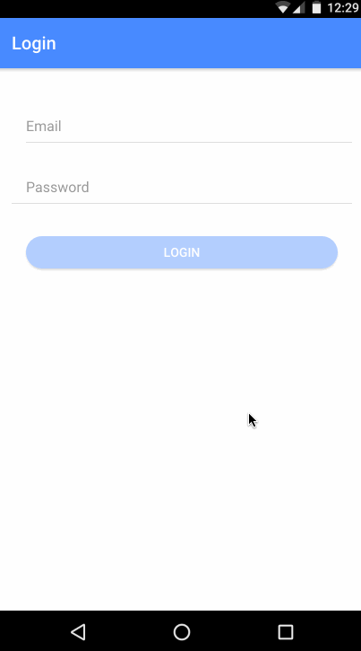

# Firebaseの設定

### プロジェクトを作成





<br>

### Email / Password ログインを許可



<br>

### ログインユーザーを作成

メールアドレス、パスワードを入力し、ログインユーザーを作成します。





<br>

### ウェブアプリにFirebaseを追加





<br><br>

# ログイン機能を実装

## angularfire2をインストール

今回は、Firebase、Angularの公式ライブラリーである [angularfire2](https://github.com/angular/angularfire2)を利用します！

```cmd
npm install firebase angularfire2 --save
```

## ログイン画面を作成

```cmd
ionic generate page Login
```

## environment.tsを作成

`src`の配下に`environment.ts`を作成し、[Firebaseの設定 > ウェブアプリにFirebaseを追加]()
でコピーした設定情報を貼り付けてください 😃

```javascript
export const environment = {
  production: false,
  firebase: {
    apiKey: "",
    authDomain: "",
    databaseURL: "",
    projectId: "",
    storageBucket: "",
    messagingSenderId: ""
  }
};
```

## app.module.tsを修正

```javascript
import { BrowserModule } from '@angular/platform-browser';
import { ErrorHandler, NgModule } from '@angular/core';
import { IonicApp, IonicErrorHandler, IonicModule } from 'ionic-angular';

// angularfire2
import { AngularFireModule } from 'angularfire2';
import { AngularFireAuthModule } from 'angularfire2/auth';
import { AngularFireDatabaseModule } from 'angularfire2/database';

// environment
import { environment } from '../environment';

import { MyApp } from './app.component';
import { HomePage } from '../pages/home/home';
import { ListPage } from '../pages/list/list';
import { LoginPage } from '../pages/login/login';

import { StatusBar } from '@ionic-native/status-bar';
import { SplashScreen } from '@ionic-native/splash-screen';

@NgModule({
  declarations: [
    MyApp,
    HomePage,
    ListPage,
    LoginPage
  ],
  imports: [
    BrowserModule,
    IonicModule.forRoot(MyApp),
    AngularFireModule.initializeApp(environment.firebase),
    AngularFireAuthModule,
    AngularFireDatabaseModule
  ],
  bootstrap: [IonicApp],
  entryComponents: [
    MyApp,
    HomePage,
    ListPage,
    LoginPage
  ],
  providers: [
    StatusBar,
    SplashScreen,
    {provide: ErrorHandler, useClass: IonicErrorHandler}
  ]
})
export class AppModule {}
```

<br>

## 本格的にログイン周りを修正していきましょう ✨

### ログイン画面をそれっぽく修正

`src/pages/login/login.html`を修正します。

```html
<ion-header>
  <ion-navbar color="primary">
    <ion-title> Login </ion-title>
  </ion-navbar>
</ion-header>

<ion-content padding>

  <ion-list>
    <ion-item>
      <ion-label floating> Email </ion-label>
      <ion-input type="email" [(ngModel)]="user.email"></ion-input>
    </ion-item>

    <ion-item>
      <ion-label floating> Password </ion-label>
      <ion-input type="password" [(ngModel)]="user.password"></ion-input>
    </ion-item>
  </ion-list>

  <div padding>
    <button
      ion-button color="primary" block round
      (click)="login(user)"
      [disabled]="!user.email || !user.password" > Login </button>
  </div>
</ion-content>

```

### ユーザーモデルを作成

`src/model/user.ts`を作成します。

```javascript
export interface User {
  email: string;
  password: string;
}
```

### ログイン処理を作成

`src/pages/login/login.ts`を修正します。

```javascript
import { Component } from '@angular/core';
import { IonicPage, NavController, ToastController } from 'ionic-angular';
import { AngularFireAuth } from 'angularfire2/auth';

import { HomePage } from '../home/home';
import { User } from '../../model/user';

/**
 * Generated class for the LoginPage page.
 *
 * See https://ionicframework.com/docs/components/#navigation for more info on
 * Ionic pages and navigation.
 */

@IonicPage()
@Component({
  selector: 'page-login',
  templateUrl: 'login.html',
})
export class LoginPage {
  user = {} as User;

  constructor(
    public navCtrl: NavController,
    private afAuth: AngularFireAuth,
    private toast: ToastController
  ) {

  }

  // Login
  async login(user: User) {
    this.afAuth.auth.signInAndRetrieveDataWithEmailAndPassword(user.email, user.password)
      .then(res => {
        // Login succeed.
        if (res.user.email && res.user.uid) {
          // Go to HomePage.
          this.navCtrl.setRoot(HomePage);

          // display the success message.
          this.toast.create({
            message: `Welcome to APP_NAME, ${res.user.email}`,
            duration: 3000
          }).present();
        } else {
          this.toast.create({
            message: `Could not find authentication details.`,
            duration: 3000
          }).present();
        }
      })
      .catch(err => {
        // Login failed.
        this.toast.create({
          message: `Login Id and Password do not match.`,
          duration: 3000
        }).present();
      });
  }

  ionViewDidLoad() {
    console.log('ionViewDidLoad LoginPage');
  }

}

```

### ログアウト処理を作成

`app.component.ts`を修正、およびログアウト処理を作成します。

```javascript
import { Component, ViewChild } from '@angular/core';
import { Nav, Platform, ToastController } from 'ionic-angular';
import { StatusBar } from '@ionic-native/status-bar';
import { SplashScreen } from '@ionic-native/splash-screen';

import { HomePage } from '../pages/home/home';
import { ListPage } from '../pages/list/list';
import { LoginPage } from '../pages/login/login';

import { AngularFireAuth } from 'angularfire2/auth';

@Component({
  templateUrl: 'app.html'
})
export class MyApp {
  @ViewChild(Nav) nav: Nav;

  rootPage: any = LoginPage;

  pages: Array<{title: string, component: any}>;

  constructor(
    public platform: Platform,
    public statusBar: StatusBar,
    public splashScreen: SplashScreen,
    private afAuth: AngularFireAuth,
    private toast: ToastController
  ) {
    this.initializeApp();

    // used for an example of ngFor and navigation
    this.pages = [
      { title: 'Home', component: HomePage },
      { title: 'List', component: ListPage },
      { title: 'Logout', component: null }
    ];

  }

  initializeApp() {
    this.platform.ready().then(() => {
      // Okay, so the platform is ready and our plugins are available.
      // Here you can do any higher level native things you might need.
      this.statusBar.styleDefault();
      this.splashScreen.hide();
    });
  }

  openPage(page) {
    // Logout
    if(!page.component) {
      this.afAuth.auth.signOut();
      this.nav.setRoot(LoginPage);
      this.toast.create({
        message: `Logout.`,
        duration: 3000
      }).present();

      return;
    }

    this.nav.setRoot(page.component);
  }
}
```

<br><br>

# まとめ 🎉

ざっくりこんな感じです！



- [angularfire2](https://github.com/angular/angularfire2)を使うと、簡単にIonicとFirebaseでログイン機能が実装できます！
- 今回は、Email/Passwordでのログインを紹介しましたが、SNS Login(Facebookなど)もできるらしいので、次回まとめて紹介したいと思います 👍

<br><br>
