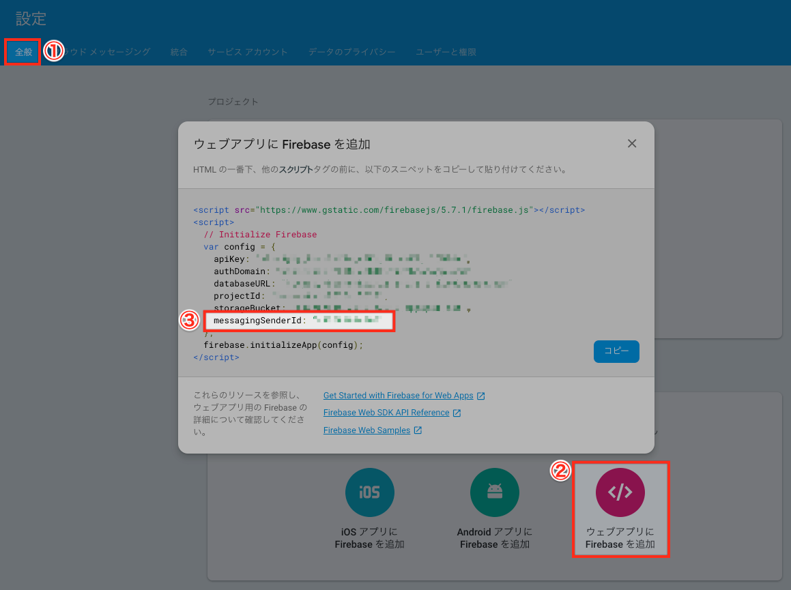
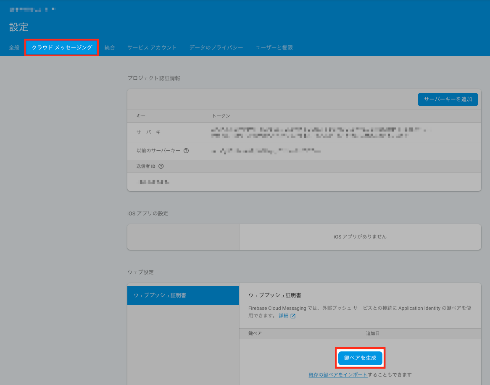

# はじめに

こんにちは！

[去年](https://qiita.com/advent-calendar/2017/fusic)に引き続き、今年も書きます。

[Fusic Advent Calendar 2018](https://qiita.com/advent-calendar/2018/fusic) 19日目の記事です！

今回は、「Angular + Firebase + PWAでPush通知機能を実装」についてまとめてみました 👏

<br>

# やりたいこと

PWAでPush機能実装したい！

※ PWAって何？的な説明は、以下を見てください
- [https://developers.google.com/web/fundamentals/codelabs/your-first-pwapp/?hl=ja](https://developers.google.com/web/fundamentals/codelabs/your-first-pwapp/?hl=ja)
- [https://developers.google.com/web/progressive-web-apps/](https://developers.google.com/web/progressive-web-apps/)

<br>

# 開発環境

- Angular 6
- Firebase
    - Realtime Database
    - Functions

<br>

# さっそく実装に入りましょう 🤩

実装については、以下の流れで説明していきたいと思います！

1. 必要なモジュールなどをインストール
2. Push機能実装：アプリ側
3. [Push機能実装：Firebase Functions側](/angular-firebase-send-push-notifications-2)


## 必要なモジュールなどをインストール

**Firebase CLIをインストール**

```cmd
yarn global add firebase-tools@latest
```

※ Firebase CLIの詳細については、[こちら](https://firebase.google.com/docs/cli/?hl=ja)を見て下さい！

**Firebaseモジュールをインストール**

```cmd
yarn add firebase --save
```

https://www.npmjs.com/package/firebase

<br>

## Push機能実装：アプリ側

### manifest.jsonを修正

ハードコード値 `gcm_sender_id` を指定するウェブアプリ マニフェストを追加する必要があります。

> 「ブラウザ送信者 ID」と、Firebase プロジェクト設定に示されるプロジェクト固有の送信者 ID 値とを混同しないでください。
> manifest.json のブラウザ送信者 ID は固定値で、すべての FCM JavaScript クライアントで共通です。

 `gcm_sender_id`は、固定値ですので、変更しないでください！

```json:title=src/manifest.json
{
  ... 省略 ...
  "gcm_sender_id": "103953800507" // ← gcm_sender_idを追加
  ... 省略 ...
}
```

### メッセージサービスワーカーを作成

Pushメッセージには、 `service worker` が必要になります。
まず、Firebaseで `messagingSenderId`をコピーしておきましょう。




次は、`src`ディレクトリの配下に `firebase-messaging-sw.js` を作成します。

そして、↑でコピーした`messagingSenderId` を、以下の `firebase.initializeApp()` に貼りつけます！

```typescript:title=src/firebase-messaging-sw.js
// Give the service worker access to Firebase Messaging.
// Note that you can only use Firebase Messaging here, other Firebase libraries
// are not available in the service worker.
importScripts('https://www.gstatic.com/firebasejs/5.5.0/firebase-app.js');
importScripts('https://www.gstatic.com/firebasejs/5.5.0/firebase-messaging.js');
    
// Initialize the Firebase app in the service worker by passing in the
// messagingSenderId.
firebase.initializeApp({
  messagingSenderId: '' // ↑でコピーしたmessagingSenderIdを追加
});
    
// Retrieve an instance of Firebase Messaging so that it can handle background
// messages.
const messaging = firebase.messaging();

messaging.setBackgroundMessageHandler(function(payload) {
  const notificationTitle = payload.notification.title;
  const notificationOptions = {
    body: payload.notification.body,
    icon: payload.notification.icon
  };

  return self.registration.showNotification(notificationTitle, notificationOptions);
});

self.addEventListener('install', function(event) {
  console.log('Service Worker installing.');
});

self.addEventListener('activate', function(event) {
  console.log('Service Worker activating.');
});

```
これで、ユーザーがアプリを閉じても、アプリが新しいメッセージを検知することができます！

### angular.jsonを修正

angular.jsonに`manifest.json`, `firebase-messaging-sw.js` を追加

```json:title=angular.json
{
  ... 省略 ...
  "projects": {
    "architect": {
      "build": {
        "options": {
          "assets": [
            "src/favicon.ico",
            "src/assets",
            "src/manifest.json", // ←追加
            "src/firebase-messaging-sw.js" // ←追加
          ]
        }
      }
    }
  }
}
```

### メッセージサービスを作成
まずは、Firebaseの「鍵ペア」を生成する必要があります。

#### Firebaseで「鍵ペア」を生成

「プロジェクトの設定＞クラウドメッセージング」に入って、鍵ペアを生成してください。



生成した鍵ペアをコピーしておいてください⭐️

#### サービスを作成

メッセージサービスは、Push通知メッセージを受け取るユーザーの許可を得る役割をします。

```cmd
ng g service messaging
```

ざっくり以下のような構成になります！

##### `getPermission()`
- ユーザーからPush通知を行う許可を取得

##### `updateToken()`
- FirebaseにFCMトークンを保存
- ユーザーにPush通知を送る度にこのトークンを参照するので、Firebaseに保存する

##### `receiveMessage()`
- メッセージを受信

```typescript:title=src/app/service/messaging.service.ts
import { Injectable } from '@angular/core';
import { AngularFireDatabase } from 'angularfire2/database';
import { AngularFireAuth } from 'angularfire2/auth';
import { BehaviorSubject } from 'rxjs';
import * as firebase from 'firebase';
import 'firebase/messaging';

@Injectable({
  providedIn: 'root',
})
export class MessagingService {
  messaging = firebase.messaging();
  currentMessage = new BehaviorSubject(null);
  constructor(
    private db: AngularFireDatabase,
    private afAuth: AngularFireAuth
  ) {
    // Add the public key generated from the console here.
    this.messaging.usePublicVapidKey(
      '' // <- ここに、上記で生成した鍵ペアを貼りつけてください
    );
  }

  updateToken(token) {
    this.afAuth.authState.subscribe((user) => {
      if (!user) {
        return;
      }

      const data = { [user.uid]: token };
      this.db.object('fcmTokens/').update(data);
    });
  }

  getPermission() {
    this.messaging
      .requestPermission()
      .then(() => {
        console.log('Notification permission granted.');
        return this.messaging.getToken();
      })
      .then((token) => {
        console.log(token);
        this.updateToken(token);
      })
      .catch((err) => {
        console.log('Unable to get permission to notify.', err);
      });
  }

  receiveMessage() {
    this.messaging.onMessage((payload) => {
      console.log('Message received. ', payload);
      this.currentMessage.next(payload);
    });
  }
}
```

#### app.module.tsを修正

```typescript:title=src/app/app.module.ts
// ... 省略 ...
import { MessagingService } from './service/messaging.service';

@NgModule({
  // ... 省略 ...
  providers: [
    MessagingService, // ← を追加
  ]
})
export class AppModule {}
```

#### app.component.tsを修正

```typescript:title=src/app/app.component.ts
// ... 省略 ...
import { MessagingService } from './service/messaging.service';

@Component({
  selector: 'app-root',
  templateUrl: './app.component.html',
  styleUrls: ['./app.component.scss']
})
export class AppComponent implements OnInit {
  message;

  constructor(private msgService: MessagingService) {}

  ngOnInit() {
    this.msgService.getPermission();
    this.msgService.receiveMessage();
    this.message = this.msgService.currentMessage;
  }
  // ... 省略 ...
}
```
これで、以下のようにアプリにアクセスすると、

「通知を許可しますか？」という確認アラートが表示されるようになります！🎉


<br><br>

引き続き、Firebase Functions側の実装については、以下の記事をご覧ください！
[👉 Angular + Firebase + PWAでPush通知機能を実装する（Firebase Functions側）](/angular-firebase-send-push-notifications-2)
